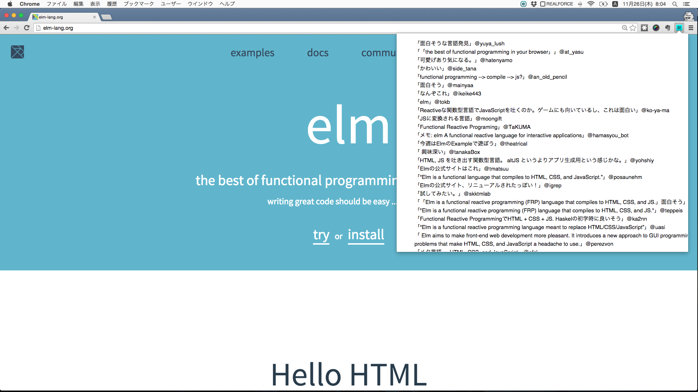

# Chrome Extentionをelmで作る

[Elm Advent Calendar 2015](http://qiita.com/advent-calendar/2015/elm)のためのサンプルです。

アイコンをクリックするとはてなブックマークのコメントを取得して表示するChrome拡張を[elm](http://elm-lang.org/)で作りました。



## Build
elm-0.16が必要です。
```
elm-make src/ChromeHtbComment.elm --output=elm.js
```

## Install
chrome://extensions/ で「パッケージ化されていない拡張を読み込む」でこのプロジェクトのディレクトリを指定する
